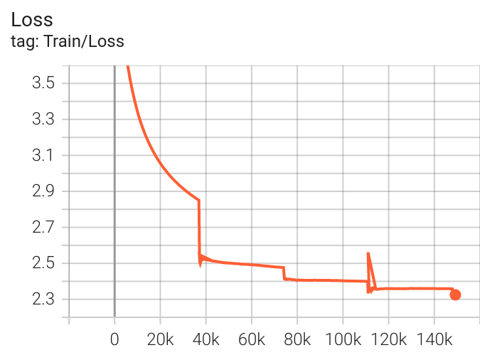
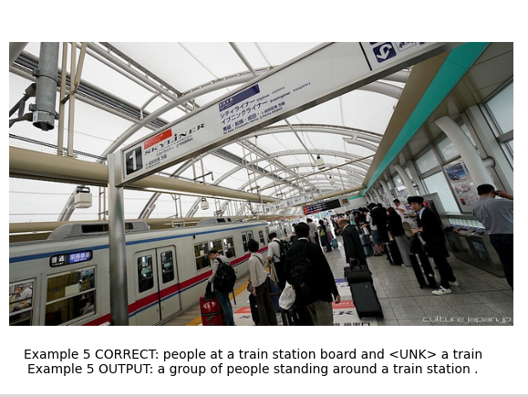
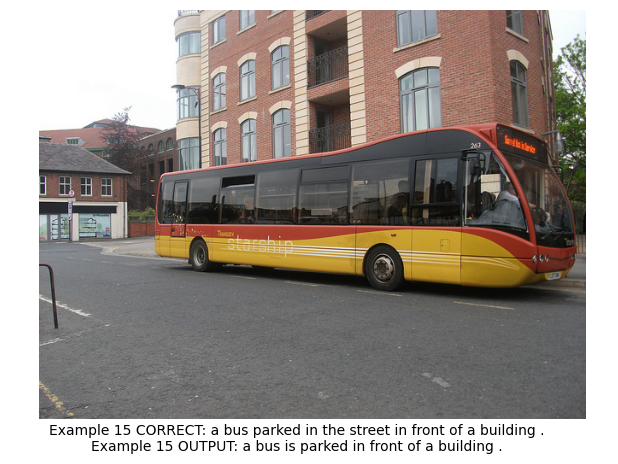
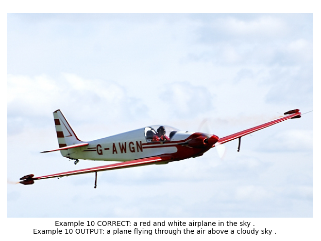
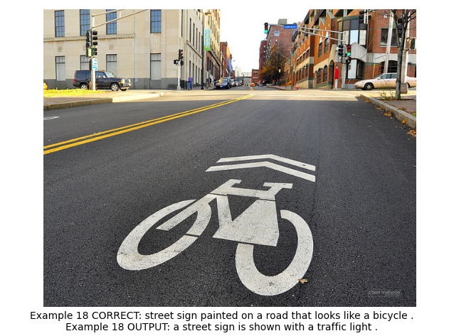
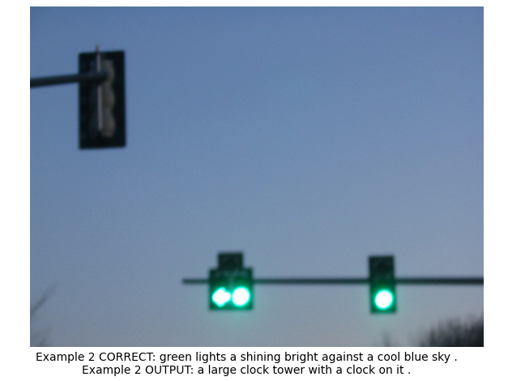
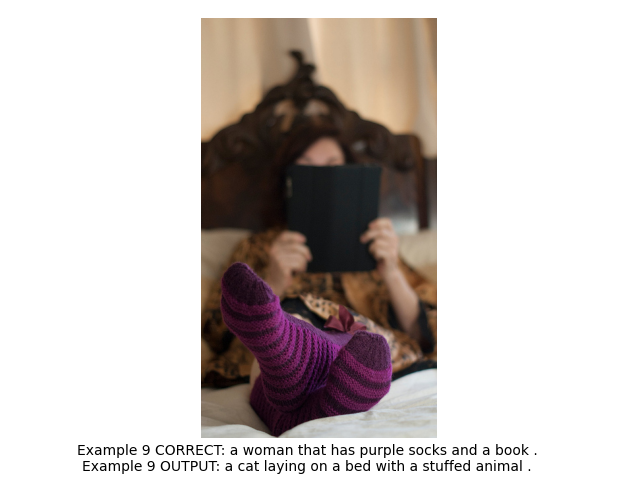
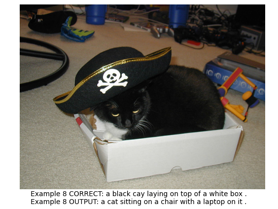
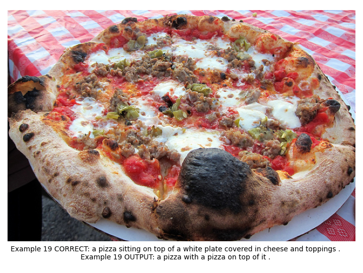

[](https://www.linkedin.com/in/%C4%91%E1%BB%A9c-v%C5%A9-6772a6248)

## Pytorch: Image Captioning

Model **describe** about the **picture** using pytorch. Here, i use **COCO Dataset ** of **500 bird species** containing about ** 800,000 images and captions** for training, validation and testing.

### Dependencies

* Python3
* Pytorch

```python
pip install spacy        # spaCy 
pip install pytorch      # pytorch library
pip install torchsummary # summary
pip install torchvision  # pytorch for vision
```

**NB**: Update the libraries to their latest versions before training.

### How to run
----------------------------------------
⬇️⬇️**Download** and extract dataset on Kaggle: [Image Captioning dataset](www.kaggle.com/vanduc0xff/image-captioning-coco-dataset)

Run the following **scripts** for training and/or testing

```python
python train.py # For training the model 
```
----------------------------------------
🤗🤗**Hugging face** version: [Hugging Face](https://huggingface.co/spaces/vvd2003/Image-Captioning)
-----------------------------------------
**Docker Image**
-----------
Run the following **scripts** for visual result of model:

**1.**
Download **[Docker](https://www.docker.com/)**

Open **CMD**

**2.**
Download my image

```python
docker pull vvduc1803/image_captioning:latest                                  # Pull image
```

**3.**
Copy and paste
```python
docker run -it -d --name image_captioning -p 1234:1234 vvduc1803/image_captioning  # Run container
```
**4.**
Copy and paste
```python
docker logs -f image_captioning                                             # Run visual result
```
------------------------------------------

### Training results

|    | Loss(Validation) | Size     | Training Epochs | Training Mode          |
|----|------------------|----------|----|------------------------|
| **Model** | 2.23             | 101.2 MB |  40 | scratch mix pretrained |

**Batch size**: 16, **GPU**: RTX 3050 4G

### Training graphs

**Model:** 

Finetuning the model.


### Sample outputs

1.Good Captions:






2.Bad Captions:






### Evaluation

**Cross Entropy Loss** of the network on ~20000 validation images: **76.38%**

### Observations

1. The **MODEL** has a very medium size i.e **0.1 GB**.
2. Adjusting parameters like **batch size, number of workers, pin_memory, ** etc. may help you **reduce training time**, especially if you have a big dataset and a high-end machine(hardware).
3. Adjusting parameters like **learning rate, epochs**, etc... maybe can help you **improve** model.
### Todo

1. Experiments with different **learning-rate and optimizers**.
2. **Converting and optimizing** pytorch models for deployment.

### Authors

Van Duc
 
### Acknowledgments
* "https://arxiv.org/abs/1502.03044"

